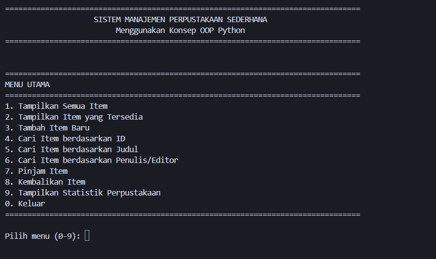
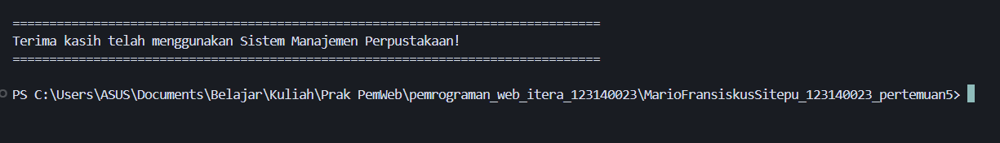

# Sistem Manajemen Perpustakaan Sederhana

Program Python untuk mengelola perpustakaan sederhana menggunakan konsep Object-Oriented Programming (OOP) yang dibuat untuk memenuhi Tugas Praktikum Pemrograman Web.

## 📋 Deskripsi Program

Sistem Manajemen Perpustakaan Sederhana adalah aplikasi berbasis command-line yang memungkinkan pengguna untuk mengelola koleksi buku dan majalah di perpustakaan. Program ini mengimplementasikan konsep-konsep OOP Python seperti Abstract Class, Inheritance, Encapsulation, dan Polymorphism.

## ✨ Fitur Utama

### Persyaratan Wajib
- ✅ **Abstract Class LibraryItem**: Base class untuk semua item perpustakaan dengan abstract methods
- ✅ **Inheritance**: Implementasi 2 subclass (Book dan Magazine) yang mewarisi dari LibraryItem
- ✅ **Abstract Methods**: Setiap subclass mengimplementasikan minimal satu abstract method dari parent class
- ✅ **Class Library**: Class untuk menyimpan dan mengelola koleksi item perpustakaan
- ✅ **Encapsulation**: Penggunaan access modifiers (protected/private) untuk melindungi data penting
- ✅ **Property Decorator**: Penggunaan property decorator untuk atribut di class
- ✅ **Fungsionalitas Dasar**:
  - Menambahkan item ke perpustakaan
  - Menampilkan daftar item yang tersedia
  - Mencari item berdasarkan judul atau ID

### Fitur Tambahan
- ✅ **Pencarian Berdasarkan Penulis/Editor**: Mencari item berdasarkan nama penulis atau editor
- ✅ **Sistem Peminjaman**: Fitur untuk meminjam dan mengembalikan item
- ✅ **Statistik Perpustakaan**: Menampilkan statistik lengkap perpustakaan
- ✅ **Tampilan Tabel**: Format tabel yang rapi menggunakan library `tabulate`
- ✅ **Validasi Input**: Validasi input untuk memastikan data yang valid
- ✅ **Data Contoh**: Program dilengkapi dengan data contoh untuk demonstrasi

## 🚀 Cara Menjalankan

### 1. Install Dependencies

```bash
pip install -r requirements.txt
```

### 2. Jalankan Program

```bash
python main.py
```

## 📊 Menu Program

1. **Tampilkan Semua Item** - Menampilkan semua item dalam format tabel
2. **Tampilkan Item yang Tersedia** - Menampilkan hanya item yang tersedia untuk dipinjam
3. **Tambah Item Baru** - Menambah buku atau majalah baru ke perpustakaan
4. **Cari Item berdasarkan ID** - Mencari item menggunakan ID unik
5. **Cari Item berdasarkan Judul** - Mencari item berdasarkan judul (partial match)
6. **Cari Item berdasarkan Penulis/Editor** - Mencari item berdasarkan nama penulis atau editor
7. **Pinjam Item** - Meminjam item dari perpustakaan
8. **Kembalikan Item** - Mengembalikan item yang dipinjam
9. **Tampilkan Statistik Perpustakaan** - Menampilkan statistik lengkap perpustakaan
0. **Keluar** - Exit program

## 🏗️ Struktur Program

### Class Diagram

```
┌─────────────────────────────────────┐
│      LibraryItem (Abstract)         │
├─────────────────────────────────────┤
│ - _id: str (protected)              │
│ - _title: str (protected)           │
│ - _author: str (protected)          │
│ - _year: int (protected)            │
│ - _is_available: bool (protected)   │
│ + title: property                   │
│ + id: property                      │
│ + borrow(): bool                    │
│ + return_item(): bool               │
│ + get_item_type(): str (abstract)   │
│ + get_details(): dict (abstract)    │
│ + display_info(): str (abstract)    │
└──────────────┬──────────────────────┘
               │
       ┌───────┴────────┐
       │                │
┌──────▼──────┐  ┌──────▼──────┐
│    Book     │  │  Magazine   │
├─────────────┤  ├─────────────┤
│ - __isbn    │  │ - _issue_   │
│ - _pages    │  │   number    │
│ - _genre    │  │ - _publisher│
│             │  │ - _frequency│
│ + get_item_ │  │ + get_item_ │
│   type()    │  │   type()    │
│ + get_      │  │ + get_      │
│   details() │  │   details() │
│ + display_  │  │ + display_  │
│   info()    │  │   info()    │
└─────────────┘  └─────────────┘
       │                │
       └────────┬───────┘
                │
         ┌──────▼──────┐
         │   Library   │
         ├─────────────┤
         │ - __items   │
         │ - __name    │
         │ + add_item()│
         │ + search_   │
         │   by_id()   │
         │ + search_   │
         │   by_title()│
         │ + display_  │
         │   all_items()│
         └─────────────┘
```

### File Structure

```
MarioFransiskusSitepu_123140023_pertemuan5/
│
├── library_item.py      # Abstract base class LibraryItem
├── book.py              # Class Book (subclass dari LibraryItem)
├── magazine.py          # Class Magazine (subclass dari LibraryItem)
├── library.py           # Class Library untuk mengelola koleksi
├── main.py              # Program utama dengan menu interaktif
├── requirements.txt     # Dependencies Python
└── README.md           # Dokumentasi program
```

## 💡 Implementasi Konsep OOP

### 1. Abstract Class dan Inheritance (30%)

**LibraryItem (Abstract Base Class)**
- Menggunakan `ABC` (Abstract Base Class) dari module `abc`
- Memiliki 3 abstract methods yang harus diimplementasikan oleh subclass:
  - `get_item_type()`: Mengembalikan tipe item
  - `get_details()`: Mengembalikan detail lengkap item
  - `display_info()`: Mengembalikan string informasi item

**Book dan Magazine (Subclass)**
- Kedua class mewarisi dari `LibraryItem`
- Mengimplementasikan semua abstract methods dari parent class
- Menambahkan atribut spesifik masing-masing (ISBN untuk Book, Issue Number untuk Magazine)

### 2. Encapsulation (25%)

**Access Modifiers:**
- **Private attributes** (double underscore `__`): 
  - `LibraryItem.__id_counter`: Class variable untuk counter ID
  - `Book.__isbn`: ISBN buku (private)
  - `Library.__items`: List item perpustakaan (private)
  - `Library.__name`: Nama perpustakaan (private)

- **Protected attributes** (single underscore `_`):
  - `_id`, `_title`, `_author`, `_year`, `_is_available`: Atribut protected di LibraryItem
  - `_pages`, `_genre`: Atribut protected di Book
  - `_issue_number`, `_publisher`, `_frequency`: Atribut protected di Magazine

**Getter Methods:**
- Property decorator untuk `title`, `id`, `author`, `year`, `is_available`
- Method `get_all_items()` mengembalikan copy dari list untuk mencegah modifikasi langsung

### 3. Polymorphism (20%)

**Method Overriding:**
- `get_item_type()`: Setiap subclass mengembalikan tipe yang berbeda ("Book" atau "Magazine")
- `get_details()`: Setiap subclass mengembalikan detail yang berbeda sesuai dengan atributnya
- `display_info()`: Setiap subclass menampilkan informasi dengan format yang berbeda
- `__str__()`: Setiap class memiliki representasi string yang berbeda

**Polymorphic Behavior:**
- Class `Library` dapat menyimpan objek `Book` dan `Magazine` dalam satu list karena keduanya adalah instance dari `LibraryItem`
- Method `display_all_items()` dapat memanggil `get_item_type()` pada setiap item tanpa perlu mengetahui tipe spesifiknya

### 4. Property Decorator

**Implementasi di LibraryItem:**
```python
@property
def title(self) -> str:
    """Getter untuk title."""
    return self._title

@title.setter
def title(self, value: str):
    """Setter untuk title dengan validasi."""
    if not value or not value.strip():
        raise ValueError("Title tidak boleh kosong")
    self._title = value.strip()
```

**Read-only Properties:**
- `id`: Property read-only untuk ID item
- `isbn`: Property read-only untuk ISBN buku

## 📝 Contoh Penggunaan

### Menambahkan Buku Baru

```
Pilih menu (0-9): 3
Pilih jenis item (1/2/0): 1

Judul Buku        : Pemrograman Python
Penulis           : John Doe
Tahun Terbit      : 2024
ISBN              : 978-1234567890
Jumlah Halaman    : 350
Genre (opsional)  : Teknologi

✅ Buku berhasil ditambahkan dengan ID: LIB1000
```

### Mencari Item berdasarkan Judul

```
Pilih menu (0-9): 5
Masukkan judul (atau sebagian): Python

✅ Ditemukan 1 item:
[Informasi buku ditampilkan]
```

### Meminjam Item

```
Pilih menu (0-9): 7
Masukkan ID item yang ingin dipinjam: LIB1000

✅ Item 'Pemrograman Python' berhasil dipinjam!
```

## ✅ Kriteria Penilaian

| Aspek | Bobot | Status | Keterangan |
|-------|-------|--------|------------|
| **Penggunaan Abstract Class dan Inheritance** | 30% | ✅ **LENGKAP** | Abstract class `LibraryItem` dengan 3 abstract methods, 2 subclass (Book dan Magazine) yang mengimplementasikan semua abstract methods |
| **Implementasi Encapsulation** | 25% | ✅ **LENGKAP** | Private attributes (`__items`, `__isbn`), protected attributes (`_id`, `_title`, dll), property decorator untuk `title`, getter methods |
| **Penerapan Polymorphism** | 20% | ✅ **LENGKAP** | Method overriding di `get_item_type()`, `get_details()`, `display_info()`, dan `__str__()`. Polymorphic behavior di class Library |
| **Fungsionalitas Program** | 15% | ✅ **LENGKAP** | Semua fitur wajib dan tambahan berfungsi dengan baik, validasi input, error handling |
| **Dokumentasi Kode** | 10% | ✅ **LENGKAP** | Docstring di setiap class dan method, komentar penjelasan, README lengkap dengan class diagram |

## 📸 Screenshot Hasil Running Program

### 1. Menu Utama

Menu utama program menampilkan semua opsi yang tersedia untuk mengelola perpustakaan.



### 2. Tampilan Semua Item (Menu 1)

Fitur untuk menampilkan semua item yang ada di perpustakaan, termasuk buku dan majalah dengan status ketersediaannya.


### 3. Keluar dari Program

Pesan terima kasih yang ditampilkan ketika pengguna memilih untuk keluar dari program.



## 🔍 Detail Implementasi

### Abstract Methods

**LibraryItem (Parent Class):**
```python
@abstractmethod
def get_item_type(self) -> str:
    """Mengembalikan tipe item."""
    pass

@abstractmethod
def get_details(self) -> dict:
    """Mengembalikan detail lengkap item."""
    pass

@abstractmethod
def display_info(self) -> str:
    """Mengembalikan string informasi item."""
    pass
```

**Book (Subclass):**
```python
def get_item_type(self) -> str:
    return "Book"

def get_details(self) -> dict:
    return {
        "id": self._id,
        "type": self.get_item_type(),
        "title": self._title,
        # ... detail lainnya
    }

def display_info(self) -> str:
    # Format khusus untuk buku
    return formatted_string
```

### Encapsulation Example

```python
class Library:
    def __init__(self, name: str = "Perpustakaan ITERA"):
        self.__items: List[LibraryItem] = []  # Private attribute
        self.__name = name  # Private attribute
    
    def get_all_items(self) -> List[LibraryItem]:
        return self.__items.copy()  # Return copy untuk mencegah modifikasi langsung
```

### Polymorphism Example

```python
# Library dapat menyimpan Book dan Magazine dalam satu list
library = Library()
library.add_item(Book(...))      # Book adalah LibraryItem
library.add_item(Magazine(...))  # Magazine adalah LibraryItem

# Method yang sama dapat bekerja dengan berbagai tipe
for item in library.get_all_items():
    print(item.get_item_type())  # Polymorphic call
    print(item.display_info())   # Setiap subclass memiliki implementasi berbeda
```

## 👨‍💻 Author

**Mario Fransiskus Sitepu**  
NIM: 123140023  
Program Studi Teknik Informatika ITERA

## 📄 License

Program ini dibuat untuk keperluan pendidikan praktikum Pemrograman Web ITERA.

## 🎯 Kesimpulan

Program ini telah mengimplementasikan semua konsep OOP yang diminta:
- ✅ Abstract Class dengan abstract methods
- ✅ Inheritance dengan 2 subclass
- ✅ Encapsulation dengan access modifiers
- ✅ Polymorphism melalui method overriding
- ✅ Property decorator untuk atribut
- ✅ Fungsionalitas lengkap untuk manajemen perpustakaan

Program siap digunakan dan telah memenuhi semua kriteria penilaian yang ditentukan.

